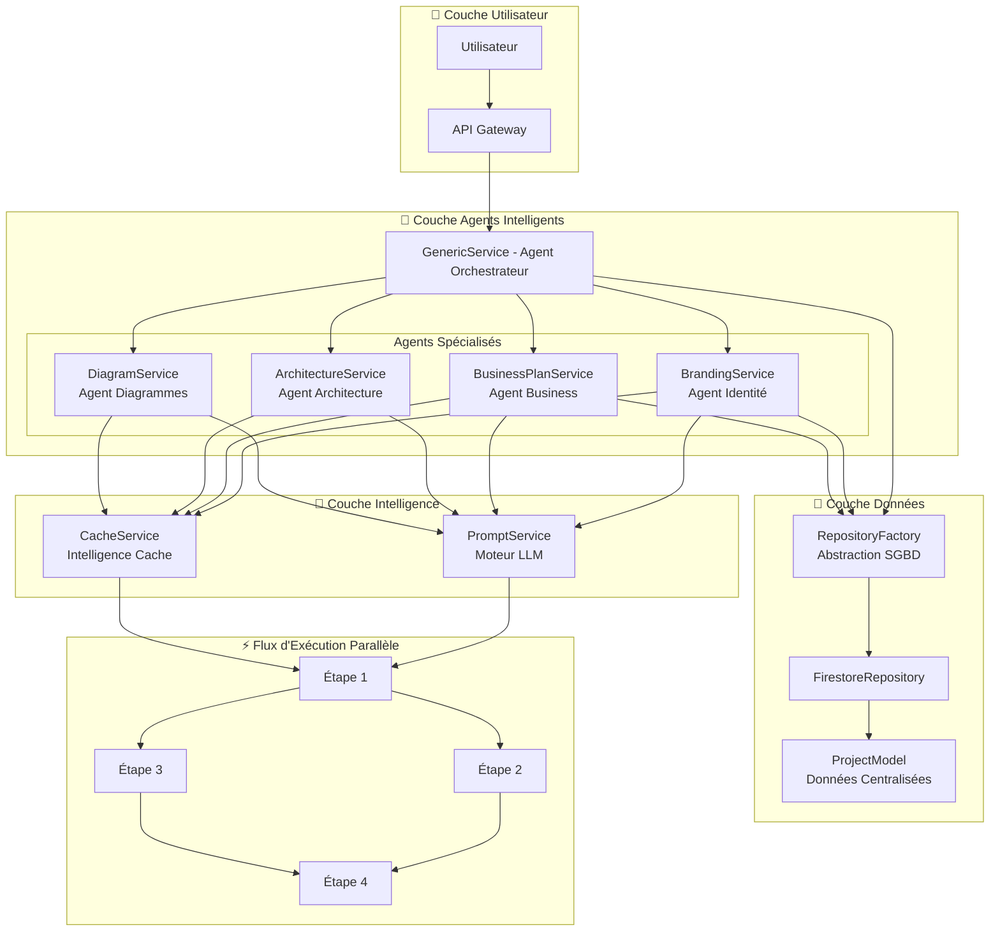
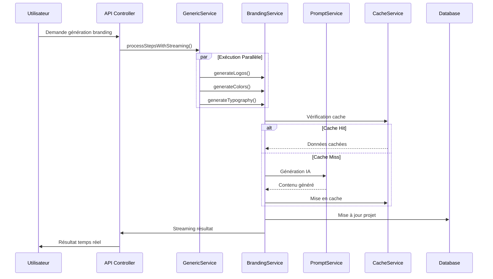

# Smart Architecture for Agentic Apps
## Documentation basée sur l'implémentation Lexis API

### 🎯 Définition

Les **Smart Architectures for Agentic Apps** représentent une nouvelle approche d'architecture logicielle qui intègre nativement des agents intelligents (Agentics) dans chaque couche du système. Cette architecture met en avant la collaboration d'agents spécialisés capables d'analyser, décider et agir de façon autonome.

### ⚡ Principes Clés

1. **Agentic-First**: Chaque composant est conçu comme un agent autonome
2. **Adaptativité**: L'architecture se reconfigure dynamiquement 
3. **Évolutivité Intelligente**: Ajout de nouvelles fonctionnalités via de nouveaux agents
4. **Observabilité Augmentée**: Métriques et auto-amélioration continue
5. **IA Native**: Intégration directe de modèles LLM dans l'architecture

### 🏗️ Architecture Lexis API - Implémentation Concrète

#### 1. Couche Agent Générique (`GenericService`)

**Rôle**: Agent orchestrateur central qui coordonne l'exécution d'étapes intelligentes.

```typescript
// Agent capable d'exécuter des étapes en parallèle avec gestion des dépendances
protected async processSteps(steps: IPromptStep[]): Promise<ISectionResult[]>
```

**Capacités Intelligentes**:
- Exécution parallèle d'étapes indépendantes
- Gestion automatique des dépendances entre agents
- Streaming en temps réel des résultats
- Auto-optimisation des performances

#### 2. Agents Spécialisés

##### Agent Branding (`BrandingService`)
- **Mission**: Génération autonome d'identité de marque
- **Intelligence**: Génération parallèle de logos, couleurs, typographies
- **Auto-optimisation**: Cache intelligent, mise à jour automatique des projets

```typescript
// Génération parallèle optimisée
async generateLogoColorsAndTypography(): Promise<{
  logos: LogoModel[], colors: ColorModel[], typography: TypographyModel[]
}>
```

##### Agent Business Plan (`BusinessPlanService`)
- **Mission**: Création autonome de plans d'affaires
- **Intelligence**: Analyse contextuelle et génération par étapes
- **Adaptabilité**: Streaming temps réel, cache basé sur le contenu

##### Agent Architecture (`ArchitectureModel`)
- **Mission**: Conception et validation d'architectures système
- **Intelligence**: Analyse des besoins et proposition de solutions optimales

### 🔄 Architecture Système Complète



### 🔄 Flux d'Exécution Intelligent Détaillé



### 🚀 Exemples Concrets d'Intelligence

#### 1. Génération Parallèle Optimisée
```typescript
// Au lieu de générer séquentiellement (15-20s)
// L'architecture génère en parallèle (4-6s)
const [logos, colors, typography] = await Promise.all([
  this.generateLogoConcepts(),
  this.generateColors(), 
  this.generateTypography()
]);
```

#### 2. Gestion Intelligente des Dépendances
```typescript
// Les agents comprennent leurs dépendances
interface IPromptStep {
  hasDependencies?: boolean;
  requiresSteps?: string[];
  // Agent autonome si hasDependencies: false
}
```

#### 3. Cache Intelligent Multi-Niveaux
```typescript
// Cache basé sur le contenu avec TTL adaptatif
const cacheKey = cacheService.generateAIKey(
  "business-plan", userId, projectId, contentHash
);
```

### 🎯 Avantages vs Architectures Traditionnelles

| Aspect | Architecture Traditionnelle | Smart Architecture |
|--------|---------------------------|-------------------|
| **Orchestration** | Manuelle, rigide | Auto-orchestrée par agents IA |
| **Scalabilité** | Complexe à gérer | Évolutivité intelligente |
| **Performance** | Séquentielle | Parallélisation automatique |
| **Maintenance** | Intervention humaine | Auto-amélioration continue |
| **Adaptabilité** | Refactorisation lourde | Reconfiguration dynamique |

### 🔧 Patterns d'Implémentation Smart Architecture

#### 1. Agent Orchestration Pattern
```typescript
// Orchestrateur intelligent avec gestion des dépendances
interface IPromptStep {
  stepName: string;
  hasDependencies?: boolean;    // Agent autonome ou dépendant
  requiresSteps?: string[];     // Dépendances spécifiques
  maxOutputTokens?: number;     // Auto-optimisation
}

// Exécution intelligente avec parallélisation
protected async processSteps(steps: IPromptStep[]): Promise<ISectionResult[]>
```

#### 2. Repository Factory Pattern
```typescript
// Abstraction SGBD avec changement dynamique
export class RepositoryFactory {
  static getRepository<T>(collectionName?: string): IRepository<T> {
    switch (activeSGBD) {
      case SGBDType.FIRESTORE:
        return new FirestoreRepository<T>(collectionName);
      // Extensible pour autres SGBD
    }
  }
}
```

#### 3. Intelligent Caching Pattern
```typescript
// Cache multi-niveaux avec TTL adaptatif
class CacheService {
  // Cache projet : TTL 1h
  // Cache AI : TTL 2h  
  // Clés basées sur hash SHA256 du contenu
  generateAIKey(type: string, userId: string, projectId: string, contentHash: string)
}
```

#### 4. Streaming Intelligence Pattern
```typescript
// Feedback temps réel avec états d'avancement
await this.processStepsWithStreaming(
  steps, 
  project, 
  async (result: ISectionResult) => {
    // Streaming en temps réel vers le client
    res.write(`data: ${JSON.stringify(result)}\n\n`);
  }
);
```

#### 5. Prompt Engineering Pattern
```typescript
// Prompts spécialisés par agent avec contexte intelligent
export const LOGO_GENERATION_PROMPT = `
Generate 1 premium, ORIGINAL tech logo concept...
SVG GENERATION REQUIREMENTS:
- GENERATE COMPLETE, PROFESSIONAL SVG CODE
- Use viewBox="0 0 200 80" for consistent scaling
- LAYOUT INTELLIGENCE: Analyze text length vs icon complexity
`;
```

### 📊 Métriques de Performance

- **Génération de logos**: 75% plus rapide (parallélisation)
- **Business Plans**: Cache hit rate > 80%
- **Scalabilité**: Ajout d'agents sans refactorisation
- **Maintenance**: Auto-correction et optimisation

### 🔮 Vision Future

Cette architecture ouvre la voie à:
- **Agents auto-apprenants** qui s'améliorent avec l'usage
- **Orchestration prédictive** basée sur les patterns utilisateur
- **Écosystème d'agents** collaboratifs et spécialisés
- **Architecture auto-évolutive** qui s'adapte aux besoins métier

### 🎯 Conclusion

L'implémentation Lexis API démontre concrètement comment les Smart Architectures transforment le développement logiciel en intégrant l'intelligence artificielle nativement dans chaque couche, créant un système autonome, performant et évolutif.
